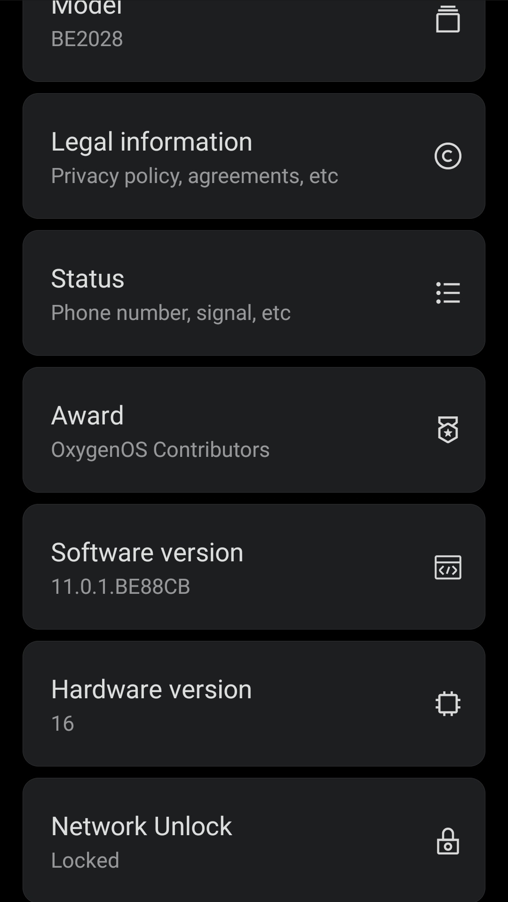
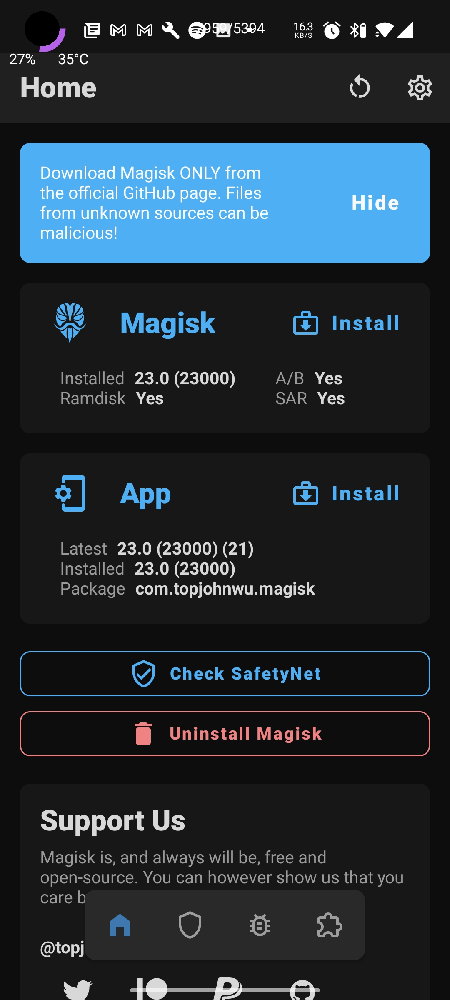
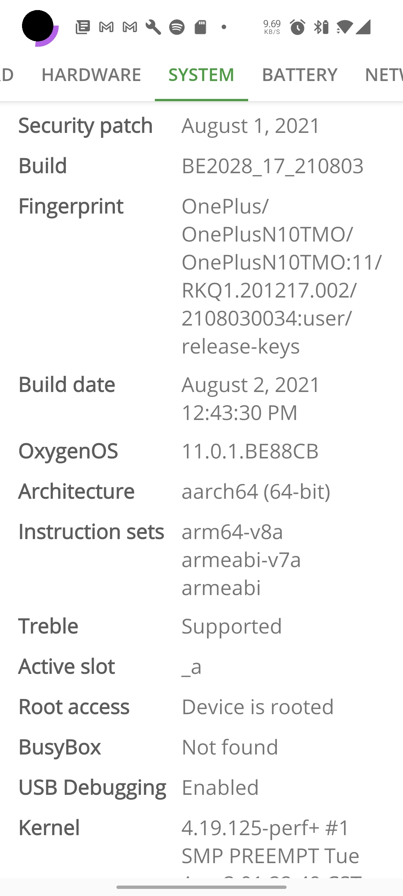
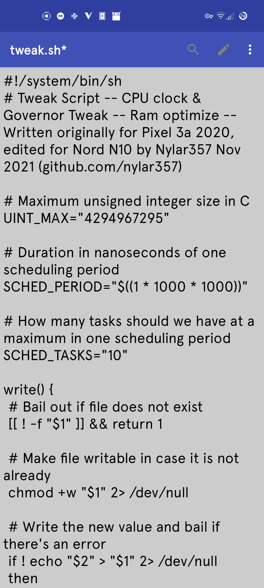
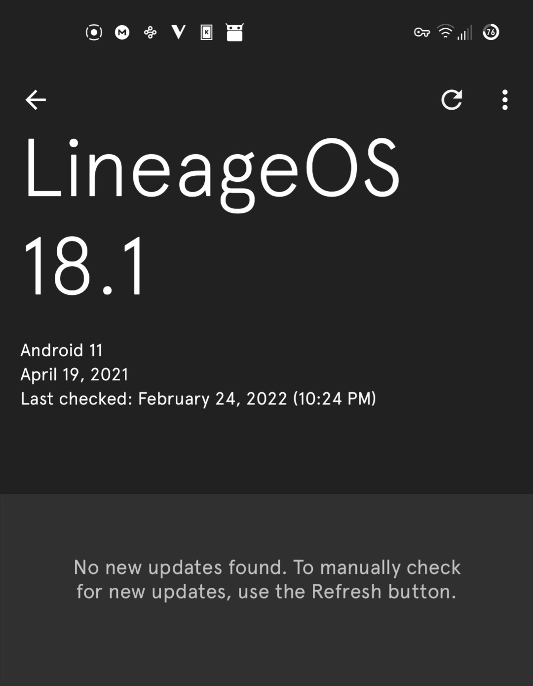
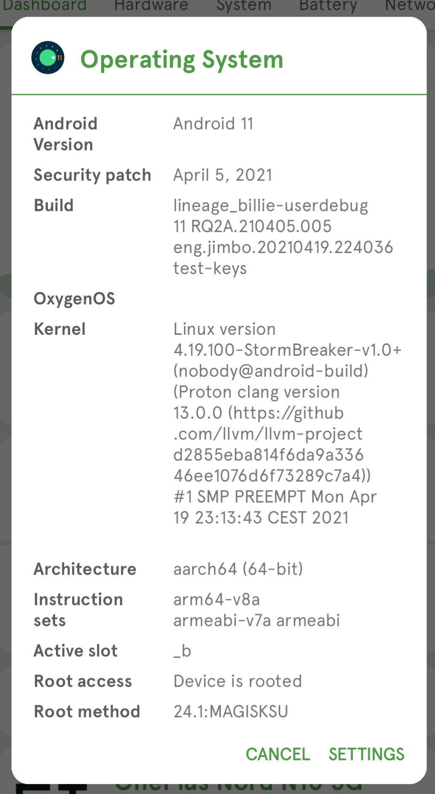
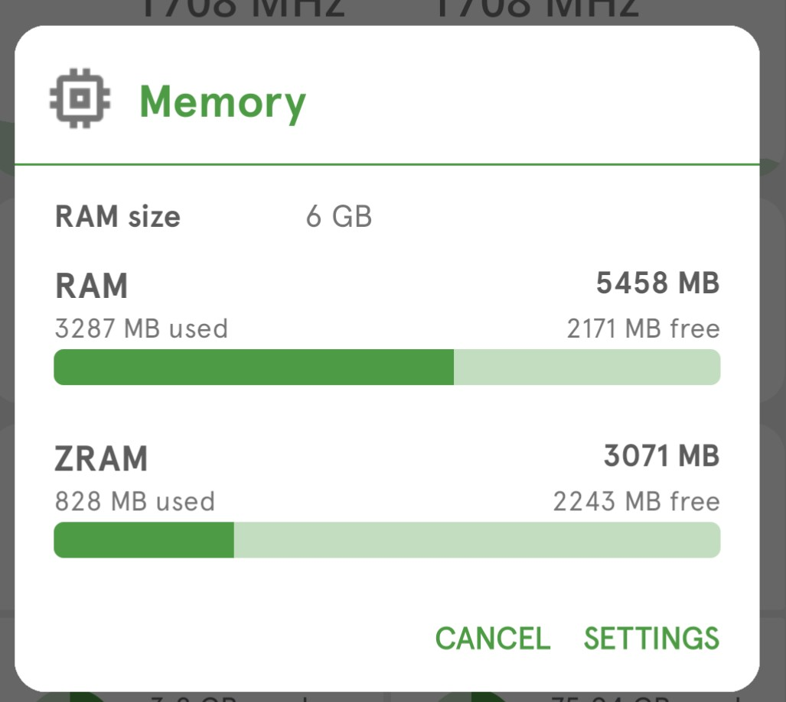
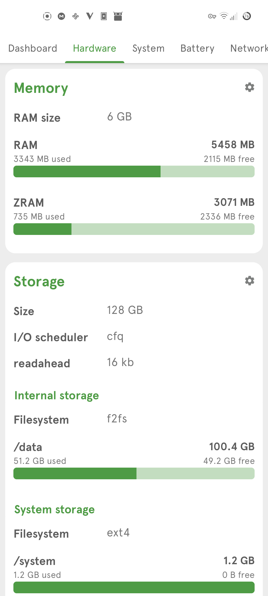

Tested Successfully on : Tmobile Nord N10 5g (billie) on Oxygen 11.0.1 BE2028 (again thanks to ```TowardsDawn``` for confirming this method working as of 02/22
I discovered this debloat script on XDA and quickly found that with it you can circumvent totally the requirement that your device be carrier unlocked from TMO (paid off &/or carrier unlock paid fee -- meaning that with this method you can root your device day 1 regardless of your payment method -- whether that be in full or as a payment plan)

[XDA Tweak Post "Chink in the Armor"](https://forum.xda-developers.com/t/found-a-chink-in-the-armor-just-enabled-oem-unlocking-after-11-update.4306687/)

As you can see below, the carrier is stil locked.  



Now you'll also see that the bootloader is unlocked & the phone is rooted.







These are the packages being uninstalled, I started with the nord applications and somewhere along the way it broke the security stopping the oem unlock feature.  I haven't narrowed it down yet.  I'm fairly certain its one of the *.oem or *.oneplus packages.  Also the Shim service is associated with the Tmobile Carrier Unlock app.  I would use the list of services in this order but its totally up to you.  I can tell you however it will work.

```
com.oem.oemlogkit   com.oem.rftoolkit   cn.oneplus.oemtcma    com.oem.logkitsdservice
cn.oneplus.oemtcma  com.oneplus.setupwizard   com.oneplus.factorymode
net.oneplus.odm     net.oneplus.odm.provider  cn.oneplus.nvbackup
com.oneplus.account net.oneplus.push    com.oneplus.brickmode   com.qualcomm.qti.uceShimService
com.android.ons   com.example.tmo   com.qualcomm.qti.remoteSimlockAuth
com.qualcomm.qti.uim   com.qualcomm.qti.uimGbaApp  org.ifaa.aidl.manager
com.google.android.apps.setupwizard.searchselector  com.qualcomm.qti.seccamservice
com.android.traceur   com.android.managedprovisioning
```
I would be careful with the original debloat script, it does remove some packages users might use regularly
or just packages that your phone may need depending on the apps you have installed & your usage.  Its not a bad
idea to check out these packages and make sure you know what your removing before you just start uninstalling system
packages.  I started with the most logical routes to removing the lock, without removing things that probably SHOULD 
be on your device.

Bootloader Unlock :

[Request your unlock token here, there is full instructions](https://www.oneplus.com/unlock_token)
This will take the whole 7 days unforunately and I tried several crypto methods but got no where.
Once you've obtained your unlock token 

```adb reboot bootloader```

```fastboot flash cust-unlock unlock_code.bin```

```fastboot flashing unlock```

Rooting :

[Oxygen 11.0.1 Extracted Boot Image](https://forum.xda-developers.com/attachments/11-0-1-be88cb-boot-img-unpatched-zip.5400901/)

[Oxygen 11.0.1 Magisk Patched Boot Image](https://forum.xda-developers.com/attachments/11-0-1-be88cb-magisk_patched-img-zip.5401133/)

[Magisk Manager 23.0](https://github.com/topjohnwu/Magisk/releases)

Install the Magisk APK either thru a traditional install or 

```adb install magisk_apk_path```

Patch the supplied boot image with magisk manager app: 

```Install > Select and Patch a File```

Select the unpatched image, make note of the patched name, and move it to your adb device (laptop/desktop)
from your computer 

```adb reboot bootloader```

```fastboot flash boot patched_image_path``` 

```fastboot reboot```

Do not interfere with the booting, in other words don't pause it by accidently pressing the power button or anything.
Once your N10 has booted up, you don't have to but I reccommend jumping back into magisk and using the Direct Install method
just to be sure your root is permanant.

Voila your now bootloader unlocked & Rooted, without ever having to payoff your phone or wait for a bumbling tmobile 
employee to unlock your device.  I would shut off Auto System Updates.  I've also included a Ktweak script & magisk module.  You can use the KTweak script
by setting it up on boot with EXKernel Manager or Franco Kernel Manager, but the Magisk Module has been working just fine for me.  This will tweak your CPU,
Memory, ect for optimum battery & performance gains.  I've been running Ktweak on several phones and amoung the universal tweaks out there is is FAR superior.

[KTweak Github page](https://github.com/nylar357/nord_oem/tree/main/Ktweak)

Update 02/22 I've been running LineageOS on my Nord for several months now and it works great!  I would avoid any version of GAPPS & avoid trying to install the playstore as all methods I've found available simply put the device into an unrecoverable bootloop.  Requiring you to start over from square one.













and for gods sake GO BACK AND DISABLE USB DEBUGGING, the Nord N10 has a wireless ADB Debugging option available and if 
you enabled that DISABLE IT and keep in mind.  Should you ever forget to turn that slightly more convienent method of
using the ADB, your handing full control over to anyone with your IP, its as simple as 

```adb connect yourip:5555```

and your 100% compromised.  So please tell your friends and never forget TURN OFF ADB DEBUGGING OF ANY FORM, IF YOUR NOT 
USING IT IN THAT MOMENT IT SHOULD NOT BE ON.

Thanks to ```TowardsDawn``` from xda-developers for alerting me to this issue, should you run into an issue with missing keyboard run the following adb commands to allow you to login and address the issue:

```adb shell input text password```
```adb shell input keyevent 66```


